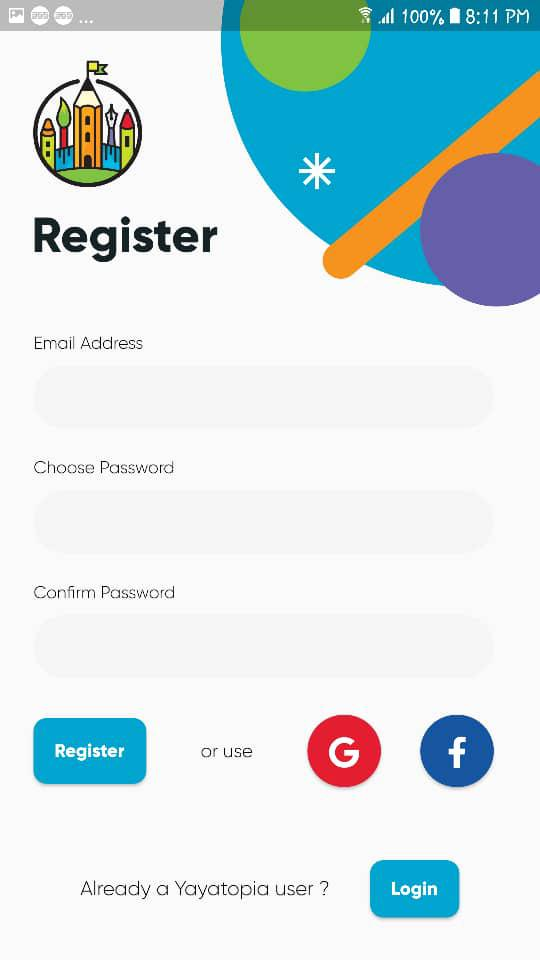
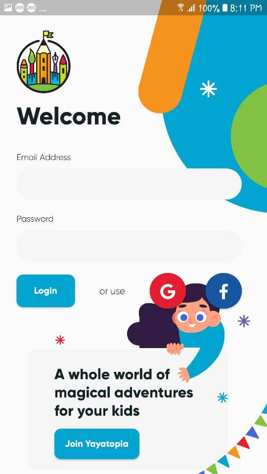
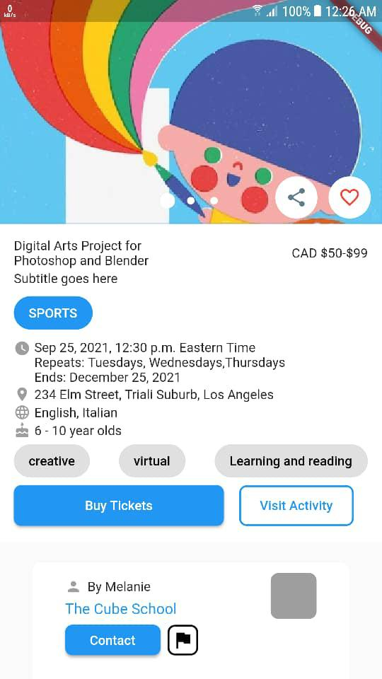
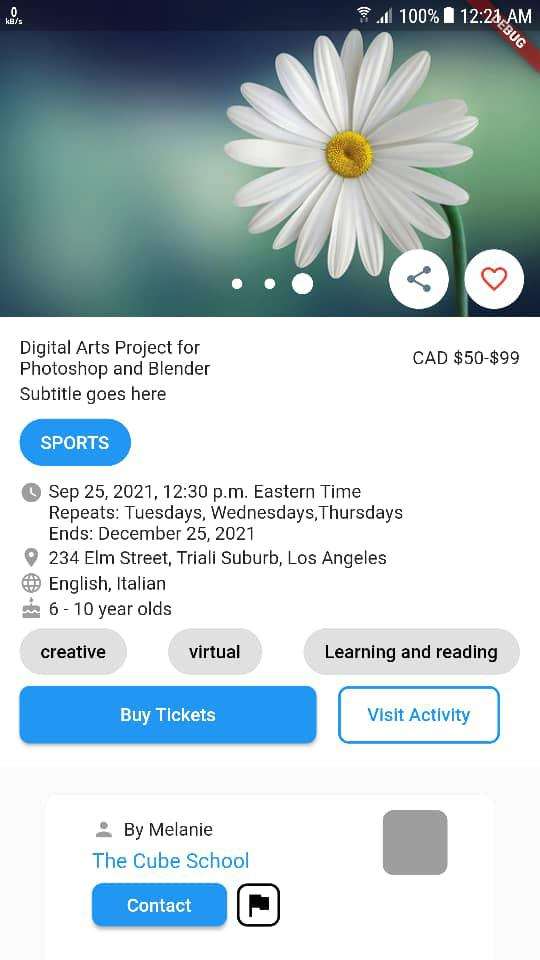

# Yayatopia - Child Activity Marketplace 🌟

Yayatopia is an innovative online marketplace for children’s activities, offering a wide range of exciting experiences in multiple locations across Canada, including:

- Alberta
- British Columbia
- Manitoba
- New Brunswick
- Northwest Territory
- Nova Scotia

From online cooking classes to music lessons and beyond, Yayatopia helps families discover new adventures or share their own activities.

## Features

- **Activity Browsing**: Explore activities tailored for kids in various locations.
- **Activity Sharing**: Share your own exciting kids' activities with the community.
- **User-Friendly Interface**: Designed for an effortless and delightful experience.

## Screenshots 📸

Take a glimpse at Yayatopia in action:







## Technologies Used

- **Flutter**: For building a seamless and cross-platform application.
- **Dart**: Powering the logic behind the app.
- **Firebase**: For backend services (if applicable).

## How to Use

1. Clone the repository:
   ```bash
   git clone https://github.com/yourusername/yayatopia.git
   ```
2. Navigate to the project folder:
   ```bash
   cd yayatopia
   ```
3. Install dependencies:
   ```bash
   flutter pub get
   ```
4. Run the app:
   ```bash
   flutter run
   ```

## Contributing

Contributions are welcome! Feel free to fork this repository and submit a pull request for review.

## License

This project is licensed under the [MIT License](LICENSE).

---

Explore more or share your adventure with Yayatopia today!
